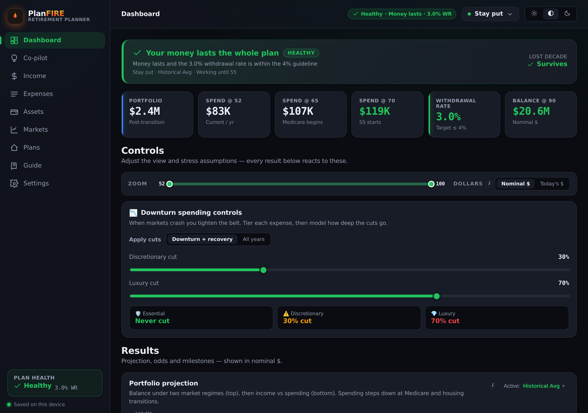
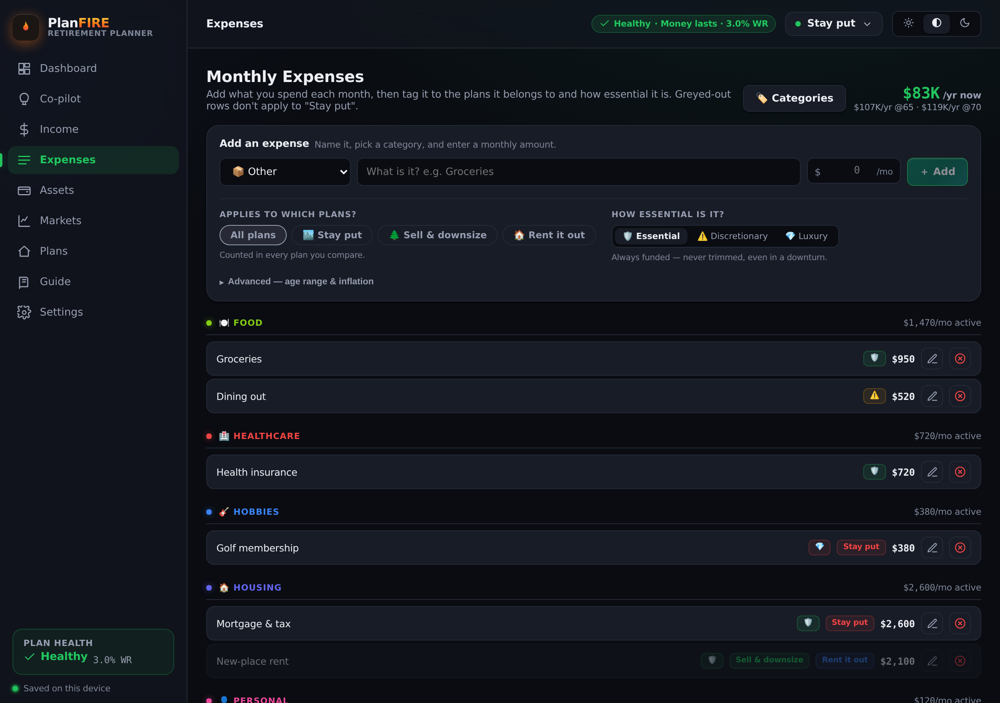
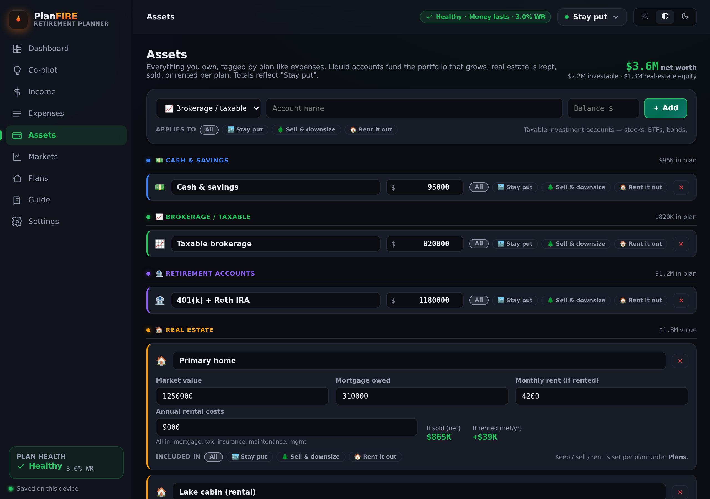
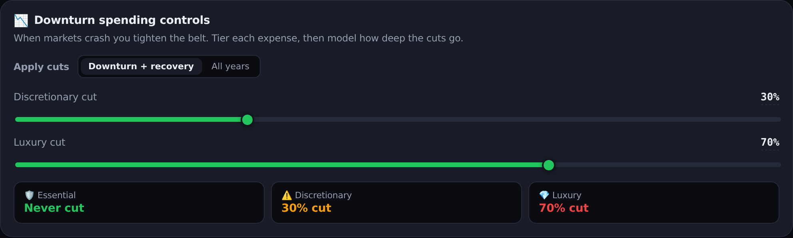
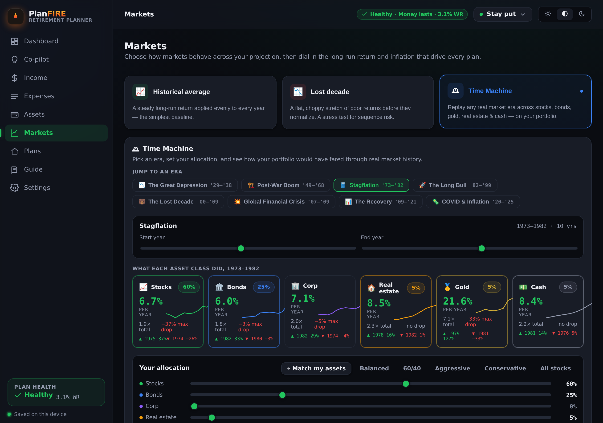

# PlanFIRE

> **Plan your escape.** Model your runway to financial independence.

PlanFIRE is a FIRE-native retirement planning dashboard — model your runway, compare housing plans, and stress-test against down markets, with server-side persistence.

## Take the tour

A full **User Guide** ships inside the app (the *Guide* tab) with screen-by-screen walkthroughs and short demo clips — and it's mirrored here on GitHub in **[docs/USER_GUIDE.md](docs/USER_GUIDE.md)**. Here's the short version.

<p align="center">
  
</p>

The dashboard is home base: a plain-language health verdict, your withdrawal rate and depletion age, live spending controls, and a full projection with FIRE milestones and Monte-Carlo odds — all recomputed the instant you change an input.

### 🏷️ Tag expenses & assets to plans

One dataset, many futures. Every expense and asset carries an **“Applies to which plans?”** control, so a mortgage tagged only to *Stay put* vanishes the moment you compare *Sell & downsize* — no duplicate scenarios, no re-entry. Real estate goes further: each plan independently marks a property **keep / sell / rent** with its own sale and rental economics.

<p align="center">
  
  
</p>

### 📉 Flex spend controls

Real retirees tighten the belt in a downturn — so your plan shouldn't be judged on rigid worst-case spending. Tier each expense **Essential / Discretionary / Luxury**, then set how deep discretionary and luxury spending flex when markets drop, and whether cuts apply only through the downturn + recovery or across all years.

<p align="center">
  
</p>

### ⏳ Time Machine

Averages hide the thing that actually breaks retirements: the *order* returns arrive in. Replay any real market era since 1928 on *your* portfolio — pick a famous window (Stagflation, the Long Bull, the GFC…) or a custom span, set your allocation, and watch the actual year-by-year highs, crashes and recoveries drive your projection.

<p align="center">
  
</p>

> 🎬 The app also has short looping demos of [tagging in action](client/public/guide/tagging.webm) and the [Time Machine](client/public/guide/time-machine.webm) — open them in the *Guide* tab.

## Architecture

```
┌─────────────┐     ┌──────────────────────┐     ┌─────────────────┐
│  React SPA  │────▶│  Express API         │────▶│  Neon Postgres   │
│  (Vite)     │ /api│  (Vercel function or │     │  (Drizzle ORM)   │
└─────────────┘     │   standalone Node)   │     └─────────────────┘
       ▲             └──────────────────────┘
       └───────────────────────┘
         Serves static files
```

- **Client**: React + Recharts, built by Vite, served as static assets (by Vercel or Express)
- **Server**: Express API — deployed as a single Vercel serverless function (`api/index.js`) or run standalone (`server/index.js`)
- **Persistence**: Neon Postgres via Drizzle ORM — per-owner state in a `jsonb` blob, survives redeploys
- **Auth**: Better Auth — email/password, Google, and Facebook, plus a guest mode that migrates anonymous data on first login
- **Fallback**: If server is unreachable, client falls back to localStorage

See [DEPLOY.md](DEPLOY.md) for the full Vercel + Neon setup guide.

## Features

- **📖 In-app User Guide** — a *Guide* tab with screen-by-screen walkthroughs, real screenshots, and short demo clips of the headline features
- **Multi-scenario planning** — create, duplicate, rename and switch between named plans; each is an independent snapshot of every input
- **Light / dark / system theming** — follows the OS by default, with a manual toggle; persisted across sessions
- **Fully responsive** — sidebar navigation collapses to a drawer on mobile; grids and charts reflow
- **User-defined housing plans** — create any number of plans (not just stay/sell/rent); each decides whether every property is kept, sold, or rented, with an optional new-home purchase and transition delay
- **Flexible properties** — model zero, one, or many properties with arbitrary values, mortgages, and rental economics
- Expense tracker with custom categories; tag each expense to whichever of *your* plans it applies to, plus age ranges, inflation overrides, and spend tiers
- Market simulation (historical avg vs "lost decade" stress test)
- **🎲 Monte Carlo success probability** — thousands of randomized return paths report the share in which your portfolio outlives you, with a terminal-wealth band (10th/50th/90th percentile).
- **🏁 FIRE milestones** — the ages your plan crosses Coast-FIRE, financial independence, $500k/$1M/$2M net worth, and (worst case) depletion — derived live from the projection.
- **✦ AI Co-pilot** — a chat assistant grounded in a minimal numeric snapshot of *your* plan. It answers with your real figures and can propose one-tap changes (e.g. "Retire at 57") applied straight to your plan. Powered by Claude; degrades to a deterministic offline reply when no API key is set.
- **⏳ Time Machine** — replay any real market era since 1928 on your actual portfolio. Allocate across stocks, Treasury bonds, corporate bonds, real estate, gold and cash, then watch real year-by-year returns drive your projection. Famous-era presets (Stagflation, the Long Bull, the Lost Decade, the GFC, …) or a custom window. Backed by a server-shipped historical dataset.
- **🔐 Accounts** — passwordless magic-link sign-in (+ guest mode that migrates your anonymous data on first login). Per-user, cookie-scoped server storage.
- **⚙️ Settings** — tabbed: Profile · Account · Notifications · Privacy & Data · Appearance · Labs.
- Downturn spending-cut modeling by expense tier
- Landlord P&L calculator
- Portfolio projection through age 95 with Social Security
- Server-synced data — access from any device on your network
- Export/Import as JSON for backups

## Client Architecture

The React app is organized for maintainability — no monolithic files:

```
src/
  theme/         ThemeProvider (palettes → CSS vars) + theme.css
  state/         PlannerProvider — scenario-backed inputs + projection math
  lib/           styles, status, scenario metadata helpers
  components/
    ui.jsx       design-system primitives (Card, Button, Chip, Modal, …)
    shell/       Sidebar, TopBar, ScenarioSwitcher, ThemeToggle, Brand
    expenses/    AddExpenseForm, ExpenseRow, CategoryManager
    plans/       PlanCard, PlanEditor (per-property keep/sell/rent)
    settings/    Profile / Market / Properties / Data sections
  views/         DashboardView, ExpensesView, PlanView, SettingsView
  App.jsx        thin shell: navigation + view routing
```

State flows one way: `StateProvider` (persistence) → `ThemeProvider` + `PlannerProvider` → views via `usePlanner()` / `useTheme()`. The projection engine (`engine.js`) stays pure and unit-tested.

## Quick Start (Docker)

```bash
cp .env.example .env   # fill in DATABASE_URL (a Neon dev branch) and other secrets
npm run db:migrate      # once, to create tables
docker compose up -d --build
```

App runs at **http://localhost:8089**.

## Quick Start (Local Dev)

Terminal 1 — server:
```bash
npm install
npm run db:migrate   # once, to create tables (needs DATABASE_URL in .env)
npm start
```

Terminal 2 — client (with hot reload + API proxy):
```bash
cd client
npm install
npm run dev
```

Client at **http://localhost:5173**, API calls proxied to **localhost:3000**.

## Deploying

PlanFIRE deploys as a Vercel serverless function backed by Neon Postgres. See
[DEPLOY.md](DEPLOY.md) for the full setup (project import, environment
variables, OAuth apps, and database migrations).

## Data & Backups

State lives in Neon Postgres (`app_state.data`, a jsonb blob per user/guest).
Use the app UI (⋮ → Export Data) to download a JSON backup, or Neon's own
branching/backup features for database-level snapshots.

## API Reference

| Method | Path | Description |
|--------|------|-------------|
| GET | `/api/state` | Get all key-value pairs |
| PUT | `/api/state` | Bulk upsert keys |
| PUT | `/api/state/:key` | Upsert single key |
| DELETE | `/api/state/:key` | Delete single key |
| DELETE | `/api/state` | Reset all data |
| GET | `/api/export` | Download state as JSON |
| POST | `/api/import` | Upload JSON to replace state |
| GET | `/api/market-history` | Historical asset-class returns dataset (read-only; powers the Time Machine) |
| GET | `/api/me` | Current user and guest flag |
| POST | `/api/account/claim-guest` | Fold anonymous guest data into an account on first sign-in |
| ALL | `/api/auth/*` | Better Auth — email/password, Google, Facebook, session, reset-password |
| POST | `/api/ai/chat` | Grounded co-pilot: `{messages, snapshot}` → `{reply, actions}` |

> `/api/state*`, `/api/export`, and `/api/import` are namespaced per user/guest by
> the session cookie — no client change was needed, the cookie rides along.

## Configuration

`DATABASE_URL` and `BETTER_AUTH_SECRET` are required; everything else is
optional — PlanFIRE runs in **demo mode** without them (verification/reset
emails are logged instead of sent, and the AI co-pilot uses a deterministic
offline reply). See `.env.example` for the full, commented list. Highlights:

| Variable | Purpose |
|----------|---------|
| `DATABASE_URL` | Neon Postgres connection string (pooled) |
| `BETTER_AUTH_SECRET` / `BETTER_AUTH_URL` | Auth session signing key and public app origin |
| `RESEND_API_KEY` / `EMAIL_FROM` | Sends verification/reset emails (else logged to console) |
| `GOOGLE_CLIENT_ID` / `_SECRET`, `FACEBOOK_CLIENT_ID` / `_SECRET` | Social login |
| `ANTHROPIC_API_KEY` | Enables the live AI co-pilot (Claude) |

See [DEPLOY.md](DEPLOY.md) for how to wire these up on Vercel.

## Historical Market Dataset

The Time Machine is backed by `server/data/marketHistory.js` — annual **nominal**
total returns by asset class, **1928–2025**, served read-only at
`/api/market-history`. It ships with the server as code (not in the mutable
`/data` store), so a user "reset" never touches it and it survives every rebuild.

Asset classes: US stocks (S&P 500, dividends reinvested), 10-year Treasury
bonds, Baa corporate bonds, US residential real estate (Case-Shiller), gold,
and 3-month T-bills (cash), plus annual CPI for real-return math.

**Sources** (public, free, widely cited):

- Aswath Damodaran, NYU Stern — *Historical Returns on Stocks, Bonds, Bills,
  Real Estate and Gold* (stocks/bills/bonds/corp/real-estate/gold).
- Robert Shiller / S&P CoreLogic Case-Shiller — residential real estate.
- U.S. Bureau of Labor Statistics — CPI-U inflation.

To refresh, replace the `RAW` rows in `server/data/marketHistory.js` with the
latest published years.

## Stack

- React 18 + Vite + Recharts
- Express + Neon Postgres (Drizzle ORM), per-owner state as a `jsonb` blob
- Better Auth (email/password + Google + Facebook + guest mode) · Claude AI co-pilot — AI is optional, demo-mode by default
- Deployed as a Vercel serverless function, or via Docker (multi-stage build)
