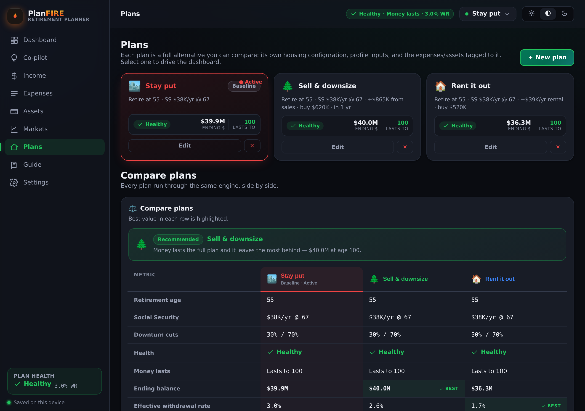
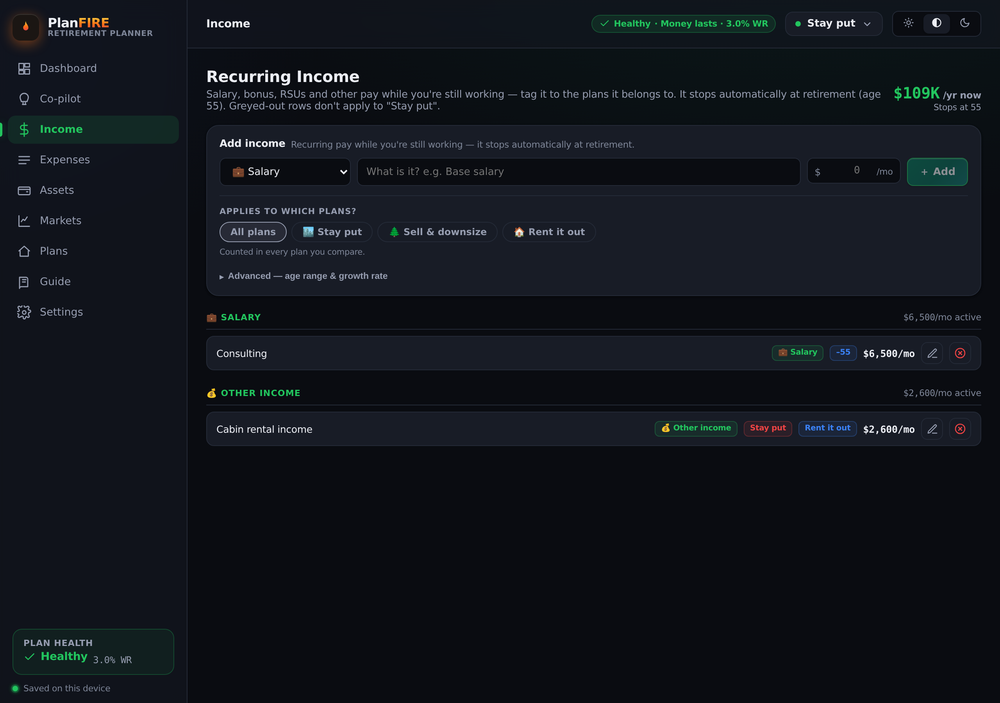
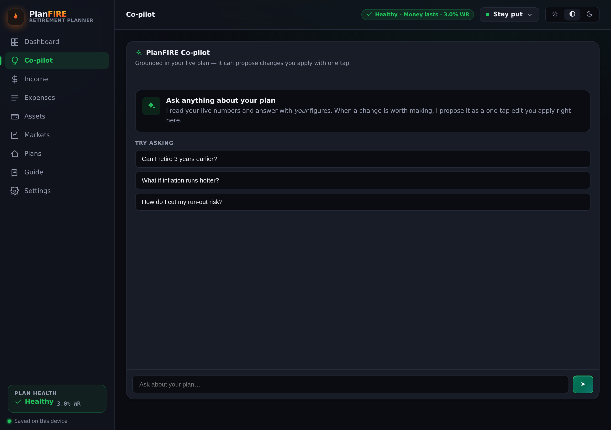

# PlanFIRE — User Guide

> **Plan your escape.** This guide walks through everything PlanFIRE can do, from your first plan to replaying a century of market history on your portfolio.

The same walkthrough ships **inside the app** under the **Guide** tab (with short looping demo clips). This document mirrors it so you can read it right here on GitHub.

## Contents

- [Start here](#start-here)
- [Plans — the spine of everything](#plans--the-spine-of-everything)
- [★ Tag expenses & assets to plans](#-tag-expenses--assets-to-plans)
- [★ Flex spend controls](#-flex-spend-controls)
- [★ Time Machine](#-time-machine)
- [Feature walkthroughs](#feature-walkthroughs)
  - [Dashboard](#dashboard) · [Income](#income) · [Expenses](#expenses) · [Assets](#assets) · [Markets](#markets) · [Plans](#plans) · [AI Co-pilot](#ai-co-pilot) · [Settings & data](#settings--data)
- [Tips & FAQ](#tips--faq)

---

## Start here

PlanFIRE models your runway to financial independence: what you own, what you earn, what you spend, and how markets treat you along the way. Four steps get you a real answer.

1. **Add your assets** — go to **Assets** and enter your accounts (cash, brokerage, retirement, real estate). Liquid accounts form the portfolio that grows; homes are modeled per plan.
2. **Add income & expenses** — under **Income** add salary, Social Security or pensions; under **Expenses** add your monthly spending, tagged by category and priority.
3. **Build a plan (or a few)** — open **Plans** to describe a strategy (*Stay put*, *Sell & downsize*, *Rent it out*). Each plan decides what happens to every property.
4. **Read the Dashboard** — your withdrawal rate, when the money lasts to, FIRE milestones and a Monte-Carlo success probability, all updating live.

  

> 🧭 Your data saves automatically — to the server when you're signed in, or to this device as a guest. The **Plan health** badge in the sidebar always shows an at-a-glance verdict for the active plan.

---

## Plans — the spine of everything

A plan is a complete what-if scenario. Because expenses and assets are tagged by plan, one set of inputs powers many futures — and you compare them side by side instead of juggling spreadsheets.

Every plan carries its own name, icon and color. For each property you own, a plan picks one action:

- **• Keep** — you hold the property
- **↑ Sell** — sell it; proceeds go into the portfolio
- **↻ Rent** — keep it and collect rent

Plans can also add a new-home purchase with a transition delay. Switch the active plan from the **plan switcher** in the top bar — every chart, milestone and probability recomputes for that plan. Duplicate a plan and change one variable to see its impact in isolation.

  

---

## 🏷️ Tag expenses & assets to plans

Tagging is what makes one dataset serve many plans. Every expense and every asset carries an **“Applies to which plans?”** control — a row of chips with **All plans** plus one chip per plan. What you tag decides what each plan counts.

**How tagging behaves**

1. **All plans (the default)** — counted in every scenario (groceries, utilities, your core brokerage account).
2. **Specific plans only** — tap one or more plan chips and the item is counted *only* in those plans. Picking a specific plan drops **All** automatically.
3. **Mix and match** — an item can belong to several plans at once (a boat slip that exists in *Stay put* and *Rent it out* but not *Downsize*).

**Why it matters** — a mortgage tagged only to *Stay put* disappears the moment you switch to *Sell & downsize*. No duplicate scenarios, no re-entry. Rows that don't apply to the active plan grey out, so you always see what's really counting.

**Assets tag the same way.** Liquid accounts only fund the portfolio in the plans they're tagged to. Real estate goes further: each plan independently marks a property **Keep / Sell / Rent**, with its own sale proceeds and rental economics.

  
  

> 🎬 See it in motion: [tagging demo clip](../client/public/guide/tagging.webm) — with *All plans* off and *Stay put* + *Rent it out* selected, the expense is counted only in those two plans.
>
> 💡 Totals on the Assets and Expenses pages always reflect the *active* plan, so the numbers you see are exactly what's feeding the current projection.

---

## 📉 Flex spend controls

Real retirees don't spend the same in a crash as in a boom — they tighten the belt. Flex spend controls model that discipline so your plan isn't judged on rigid, worst-case spending it would never actually maintain.

**Step 1 · Tier every expense.** When you add an expense you set how essential it is:

| Tier | Behavior in a downturn |
|------|------------------------|
| 🛡️ **Essential** | Always funded — never trimmed |
| ⚠️ **Discretionary** | Trimmed first when markets drop |
| 💎 **Luxury** | Cut the most — nice-to-haves like big trips |

**Step 2 · Set the cuts.** On the **Dashboard**, two sliders set how deep to cut *Discretionary* and *Luxury* spending (0–100% each). Then choose **when** they apply:

- **Downturn + recovery** — belt-tightening only during down markets and while recovering.
- **All years** — a permanently leaner budget across the whole projection.

  

> 🎯 Flex spending is one of the most powerful levers you have. A plan that looks shaky at full spend can turn resilient when discretionary and luxury spending flex down in bad years — because the biggest damage from a crash is selling assets while they're cheap. Try modest cuts and watch your success probability move.

---

## ⏳ Time Machine

Averages hide the thing that actually breaks retirements: the *order* returns arrive in. The Time Machine replays real market history — every year since 1928 — on **your** portfolio, so you can see how you'd have fared living through it.

**How to use it**

1. **Pick an era** — choose the **Time Machine** regime on the **Markets** page, then tap a famous window (Stagflation, the Long Bull, the Lost Decade, the GFC…) or drag the start/end sliders to any custom span.
2. **Set your allocation** — spread across stocks, Treasury & corporate bonds, real estate, gold and cash. Use a preset (Balanced, 60/40, Aggressive…) or hit **⌖ Match my assets** to mirror what you actually hold.
3. **Read the outcome** — each asset class shows its real CAGR, total growth and worst drawdown for that window; your blended mix reports a combined return before and after inflation.

**What it drives** — the replayed era feeds your real projection year by year, not a smooth average but the actual highs, crashes and recoveries in sequence. That's the honest stress test for *sequence-of-returns risk*. Toggle **Loop this era for the whole retirement** to repeat the window's returns for the full horizon; leave it off and your portfolio continues at the steady return once the era ends.

  

> 🎬 See it in motion: [Time Machine demo clip](../client/public/guide/time-machine.webm).
>
> 📚 The dataset is nominal total returns by asset class, 1928–2025, sourced from Damodaran (NYU Stern), Shiller / Case-Shiller and the BLS. It ships with the app, so a data reset never touches it.

---

## Feature walkthroughs

A hands-on tour of every screen, with the real interface and step-by-step instructions.

### Dashboard

Your command center. Everything here reflects the active plan and recomputes the moment you change an input anywhere in the app.

1. **Read the health banner** — a plain-language verdict (Healthy / At risk), whether the money lasts, and how the plan survives a Lost-Decade stress test.
2. **Scan the stat cards** — portfolio, spending at key ages (Medicare, Social Security), your withdrawal rate vs the 4% guideline, and the projected balance at 90.
3. **Dial the controls** — zoom the age range, flip between Nominal $ and Today's $, and set the Downturn spending cuts.
4. **Study the results** — the portfolio projection under two market regimes, income vs spending, FIRE milestones, and the Monte-Carlo success probability.

### Income

Model every income stream and exactly when it starts and stops, so the projection matches real life.

1. **Add a stream** — pick a type (Salary, Bonus, RSU/Equity, Other), name it, enter the amount, and tag it to the plans it belongs to.
2. **Bound it by age** — set start/stop ages (e.g. consulting income that ends at 55, or a pension that begins at 65).
3. **Handle equity** — RSUs can be a steady annual figure or an explicit multi-year vesting schedule the engine spreads across the right ages.

  

### Expenses

Your monthly spending, organized so it can flex and vary across plans and ages.

1. **Add an expense** — choose a category, name it, and enter a monthly amount. The form keeps your category and tags so similar rows are quick.
2. **Tag & tier it** — set which plans it applies to and how essential it is (Essential / Discretionary / Luxury); the tier drives the flex-spend cuts.
3. **Refine with advanced** — optionally limit an expense to an age range (e.g. travel until 80) or override its inflation (use 0% for a fixed mortgage).
4. **Manage categories** — the Categories button lets you add your own categories with custom icons and colors.

### Assets

One unified pool of what you own. Liquid accounts grow with the market; real estate is handled per plan.

1. **Add an account** — pick a type (Cash, Brokerage, Retirement, Real estate, Other), name it, and enter a balance. Tag it to the relevant plans.
2. **Detail your property** — for real estate, add market value, mortgage owed, and (if you'd rent it) monthly rent and annual costs. The card shows net-if-sold and net-if-rented.
3. **Set keep/sell/rent** — chosen per plan on the Plans page; the Assets page shows which plans include each property.

### Markets

Decide how markets behave across your projection — from a simple average to a full historical replay.

1. **Choose a regime** — Historical average (a steady return), Lost decade (a sequence-risk stress test), or the Time Machine (replay a real era).
2. **Set return & inflation** — dial the long-run nominal return and the inflation that erodes it; the page shows the resulting real return live.
3. **See the impact** — every plan and projection uses these assumptions, so changes here ripple straight to the Dashboard.

### Plans

Where scenarios are born. Build as many as you like and compare them without re-entering a thing.

1. **Create or duplicate** — start fresh or duplicate an existing plan and tweak a single variable to isolate its effect.
2. **Decide each property** — per plan, mark every property Keep, Sell or Rent, and optionally add a new-home purchase with a transition delay.
3. **Compare head to head** — switch the active plan from the top bar; the whole app re-projects instantly for that plan.

### AI Co-pilot

Ask questions in plain English and get answers grounded in a numeric snapshot of your actual plan.

1. **Ask anything** — “Can I retire at 57?”, “What if inflation runs hot?” — answered with your real figures, not generic advice.
2. **Apply suggestions** — it can propose concrete changes (e.g. shift the retirement age) that you apply with one tap.
3. **Works offline too** — without an API key it falls back to a deterministic offline reply, so the feature never hard-fails.

  

### Settings & data

Tabbed Settings cover **Profile · Account · Notifications · Privacy & Data · Appearance · Labs**. Appearance offers light / dark / system themes; Labs holds experimental flags. Under **Privacy & Data** you can export a full JSON backup, import one, or reset everything.

---

## Tips & FAQ

**How do I compare two strategies fairly?**
Build both as plans, tag any expense or asset that differs between them, and switch plans in the top bar. Everything recomputes for the active plan, so you're comparing like for like.

**My money runs out too early. What should I try first?**
In order: raise the retirement age slightly, turn on flex spend controls (Discretionary/Luxury cuts), lower the withdrawal by trimming or age-gating luxury expenses, and check your Markets return isn't unrealistically low. The Co-pilot can suggest and apply these for you.

**Is the Time Machine a prediction?**
No — it's a replay of what actually happened. It answers “how would my portfolio have handled the 1970s / the GFC / a lost decade?”, a far better test of resilience than any single average return.

**Where does my data live, and is it safe?**
Signed in, it's saved per-user to the server and synced across your devices; as a guest it stays only on this device. Either way you can export a JSON backup any time from **Settings → Privacy & Data**.

**What do the plan-health colors mean?**
They summarize the active plan's withdrawal rate and whether the money lasts. Green is comfortable, amber is tight, red means the projection depletes before age 95 — a cue to adjust spending, age, or allocation.

---

*Screenshots use a seeded, illustrative demo household — the figures are examples, not real user data.*
